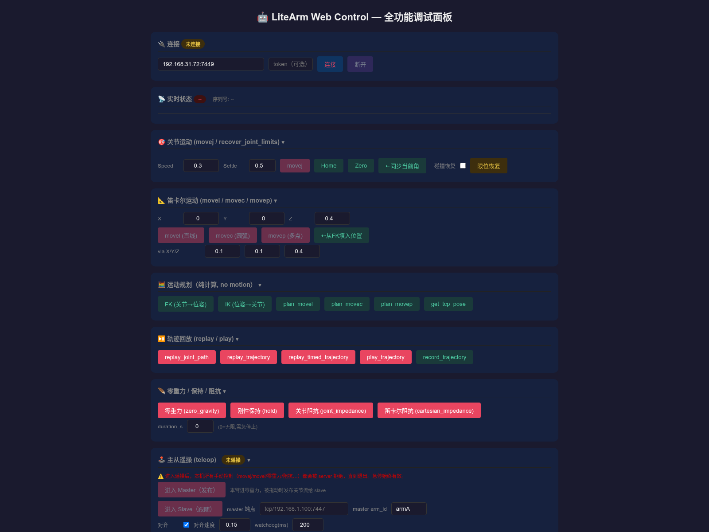
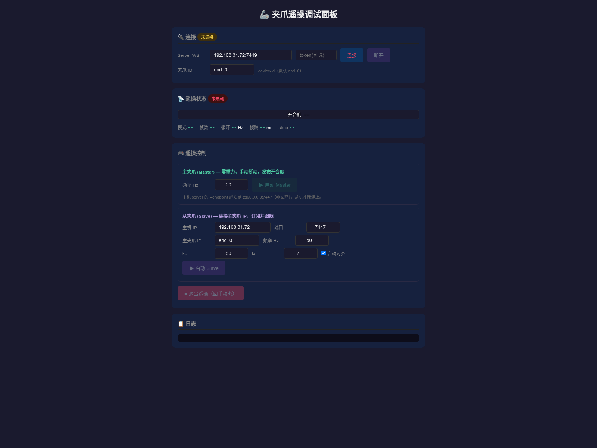

# litearm-js Browser Examples

Browser examples that control the arm and its end-effector peripherals through
the litearm-js SDK over WebSocket.

| Example | Description |
|---|---|
| [index.html](index.html) | LiteArm Web Control — full-featured debugging panel |
| [gripper-teleop.html](gripper-teleop.html) | Gripper teleop debugging panel (master / slave grippers) |

## Prerequisites

1. The arm control service is running with the WebSocket endpoint enabled
   (default `ws://<server>:7447`):

   ```bash
   python -m litearm_server --endpoint tcp/0.0.0.0:7447 --iface can0
   ```

2. The browser and the server are on the same network.

## Run

```bash
cd litearm-js
npx serve examples
# open http://localhost:3000/index.html in a browser
```

Fill in the WebSocket endpoint and arm-id in the top-left corner of the page,
then click **Connect** to start controlling.

## LiteArm Web Control — Full-Featured Debugging Panel

`index.html` covers the complete litearm-js API — a hands-on demonstration of the
SDK's feature set:

- 🎯 Joint motion: `movej` / `recover_joint_limits`
- 📐 Cartesian motion: `movel` / `movec` / `movep`
- 🧮 Motion planning (pure computation, arm does not move): `fk` / `ik` / `plan_movel` / `plan_movec` / `plan_movep`
- ⏯ Trajectory replay: `replay_trajectory` / `replay_joint_path` / `replay_timed_trajectory` / `play_trajectory`
- 🪶 Zero-gravity / hold / impedance: `zero_gravity` / `hold` / `joint_impedance` / `cartesian_impedance` / `joint_follow`
- ⚖️ End-effector payload: `set_payload` / `get_payload`
- 🏗️ Mounting orientation: `set_installation` / `get_installation`
- 📊 PD gains / faults: `set_gains` / `get_gains` / `clear_faults`
- 🖥️ System info: `get_system_stats` / `get_logs`
- ⚙️ Settings: joint limits / zero offsets / end effector / Cartesian limits / collision config
- 📁 Trajectory file management: record / save / list / replay / delete
- Peripheral devices: dexterous hand `open` / `close` / `set_gesture`, gripper `set_width` / `get_width`



## Gripper Teleop Debugging Panel

`gripper-teleop.html` demonstrates master / slave gripper teleoperation:

- Specify the WebSocket endpoint and device ID for the local (master) and remote
  (slave) grippers
- Open the master gripper, move the slider or call `set_width` — the remote
  gripper follows in real time
- The log panel shows the normalized opening width exchanged between the two ends



## License

Proprietary
